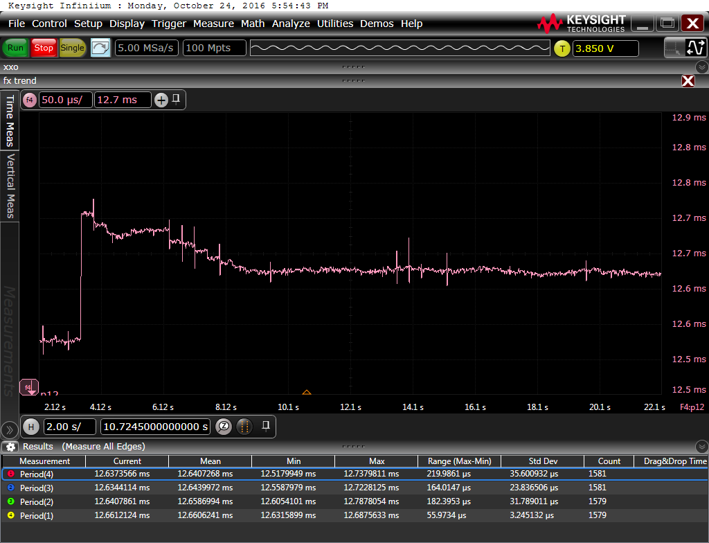

Measurements
============

Setup Configurations
====================

Particle Speed (internal RC osc.)
---------------------------------
| Particle ID | Approx. Frequency [MHz]|
|-------------|--------------------|
| 1  | 8.178 |
| 2  | 8.180 |
| 3  | 8.191 |
| 4  | 8.211 |
| 5  | 8.241 |
| 6  | 8.254 |
| 7  | 8.279 |
| 8  | 8.284 |
| 9  | 8.386 |
| 10 | 8.303 |
| 11 | 8.355 |
| 12 | 8.382 |

* Measurements taken with particles having room temperature.
* Measured after powered 30sec. 
* Averaged 5sec (~7000 samples).

Order Setup in Measurements
---------------------------
Setup ID | Network Dimension | Order P.ID | Address | Details |
|--------|-------------------|-------|--------------|---------|
| net1     | (12x1) | {6, 3, 9, 1, 7, 4, 11, 2, 10, 5, 12} | {(1,1), (2,1), (3,1), (4,1), (5,1), (6,1), (7,1), (8,1), (9,1), (10,1), (11,1), (12,1)} | order having good discrepancy in between subsequent particles's frequency |
| net2     | (12x1) | {6, 2, 10, 1, 8, 4, 12, 3, 9, 7, 11, 6, 5} | {(1,1), (2,1), (3,1), (4,1), (5,1), (6,1), (7,1), (8,1), (9,1), (10,1), (11,1), (12,1)} | same as 1 but less discrepancy |

Oscilloscope Measurement Notes
------------------------------
| Setup ID | Capture Duration [s] | [MSa/s] | Pre-Trigger [s] |  Details |
|----------|----------------------|---------|-----------------|----------|
| osc1        | 2.8 - 7.8            | 5       | 5              | cap1       |
| osc2        | 2 - 22               | 5       | 10.7           | cap1       |              

Capacitor Configurations
------------------------

| Setup ID | Caps [µF] | Configuration |
|----------|-----------|---------------|
| cap1       | 560       | each 2nd particle |

Software Configuration
----------------------
| Setup ID | Averaging Method | outlier rejection | FiFo Size [Elements] | Pitch |
|----------|------------------|-------------------|–---------------------|-------| 
| soft1    | mean             | -                 | 4                    | 16    |
