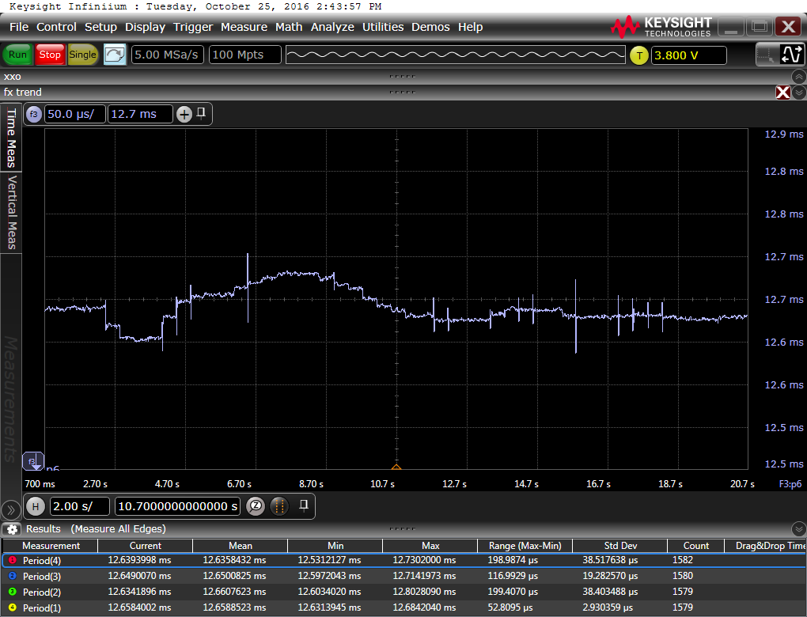
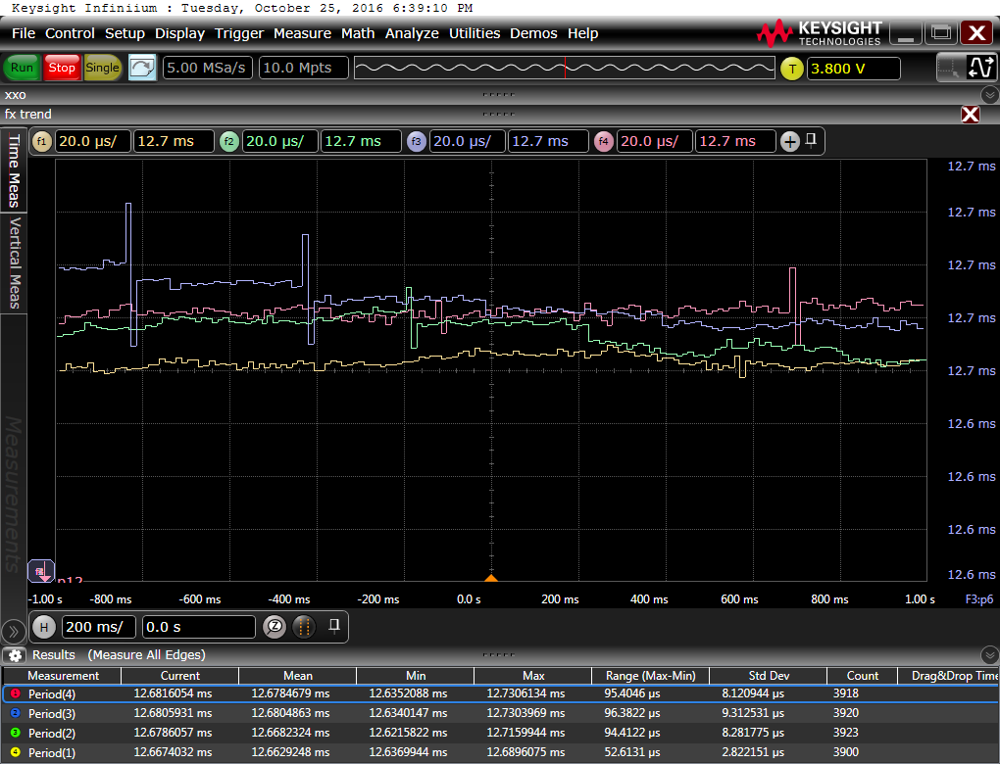
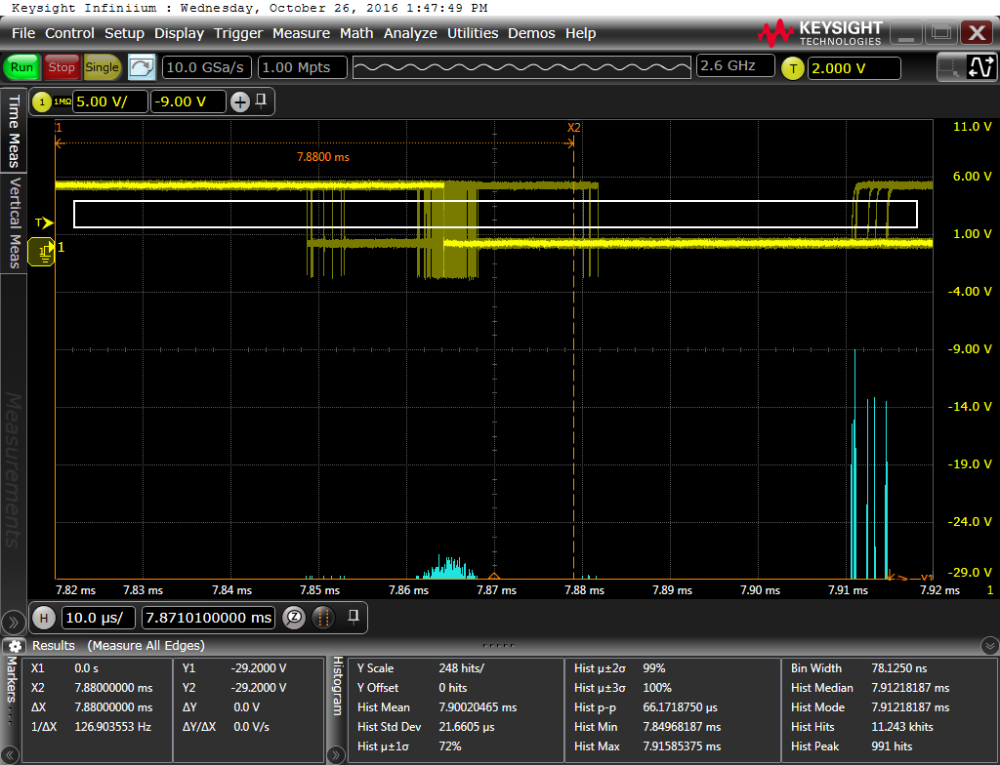
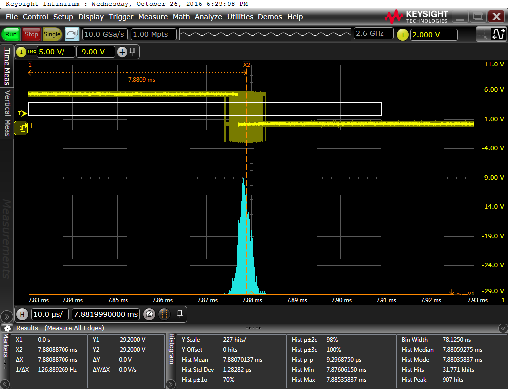
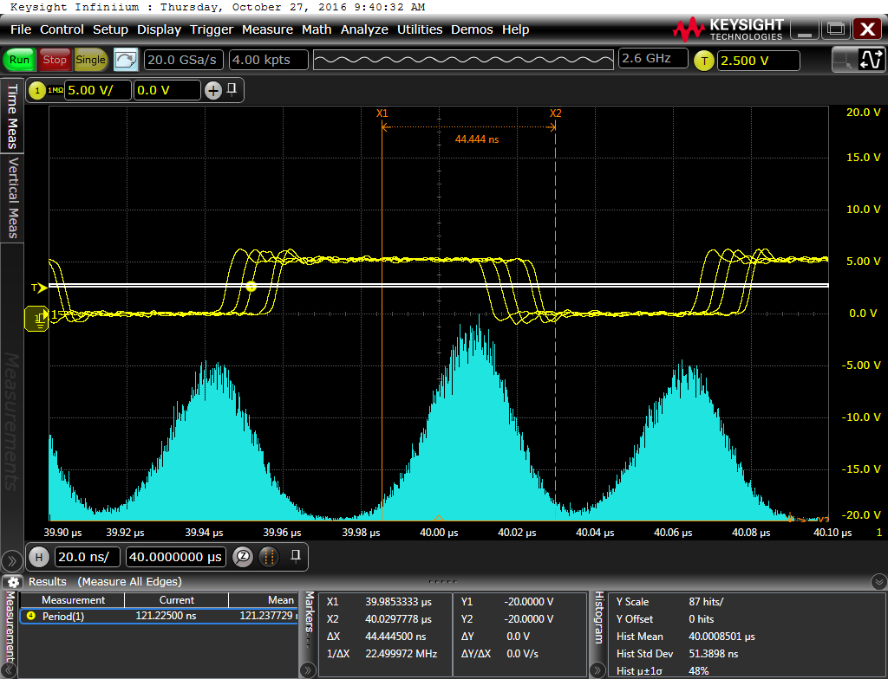
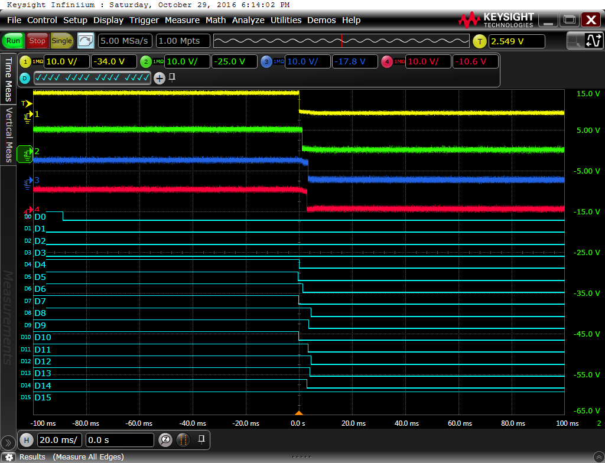

Measurements
============

Clock Skew Synchronization
--------------------------

### Short Term (Startup) Clock Skew Synchronization

| Result | Setup | Description | 
|--------|-------|-------------|
|      | soft1, cap1, osc2, net1, mcu1, func[1-4]-1, proAn[1-4]-1 | fifo 4, mean, caps, 20s | 
|      | soft1, cap1, osc1, net1, mcu1, func[1-4]-1, proAn[1-4]-1 | fifo 4, mean, caps, 5s | 
|      | soft1, cap0, osc2, net1, mcu1, func[1-4]-1, proAn[1-4]-1 | fifo 4, mean, 20s | 
|      | soft1, cap0, osc1, net1, mcu1, func[1-4]-1, proAn[1-4]-1 | fifo 4, mean, 5s | 
|  | soft1, cap1, osc2, net2, mcu1, func[1-4]-1, proAn[1-4]-1 | fifo 4, mean, caps, 20s |
|      | soft13, cap1, osc2, net1, mcu1, func[1-4]-1, proAn[1-4]-1 | fifo 4, mean, pitch 22, caps, 20s |
|           | soft2, cap0, osc2, net1, mcu1, func[1-4]-1, proAn[1-4]-1 | progressive mean, caps, 20s | 
|          | soft2, cap0, osc1, net1, mcu1, func[1-4]-1, proAn[1-4]-1 | progressive mean, caps, 5s | 
|         | soft2, cap0, osc2, net1, mcu1, func[1-4]-1, proAn[1-4]-1 | progressive mean, 20s | 
|          | soft2, cap0, osc1, net1, mcu1, func[1-4]-1, proAn[1-4]-1 | progressive mean, 5s | 
|          | soft3, cap1, osc2, net1, mcu1, func[1-4]-1, proAn[1-4]-1 | raw observation, caps, 20s | 
|          | soft3, cap0, osc2, net1, mcu1, func[1-4]-1, proAn[1-4]-1 | raw observation, 20s | 
|         | soft3, soft4 (particle 4), cap0, osc3, net1, mcu1, func[1-4]-1, proAn[1-4]-1 | particle 4 having linear regression, raw observation otherwise, 46s |
|      | soft4 cap0, osc4, net1, mcu1, func[1-4]-1, proAn[1-4]-1 | linear regression, overshooting, 98s, probe An. 3 and An. 4 mistakenly swapped |
|      | soft18 cap0, osc15, net1, mcu1, func[1-4]-1, proAn[1-4]-1 | linear regression, overshooting, 50s, pre-filled fifo |
|      | soft17 cap0, osc15, net1, mcu1, func[1-4]-1, proAn[1-4]-1 | linear regression, overshooting, 50s, empty fifo |
|      | soft17 cap0, osc16, net1, mcu1, func[1-4]-1, proAn[1-4]-1 | linear regression, overshooting, 89s, empty fifo |
|              | soft19, cap0, osc16, net1, mcu1, func[1-4]-1, proAn[1-4]-1 | linear regression, overshooting, 89s, pre-filled fifo, outlier: 5*sigma |
|       | soft20, cap0, osc16, net1, mcu1, func[1-4]-1, proAn[1-4]-1 | linear regression, overshooting, 89s, pre-filled fifo, outlier: 10*sigma |
|        | soft5 cap0, osc2, net1, mcu1, func[1-4]-1, proAn[1-4]-1 | fifo 4, mean without outlier 2sigma, 20s |


| Video | Setup | Description | 
|-------|-------|-------------|
| [sync-method-mean-fifo40-pitch16](https://drive.google.com/open?id=0Bx3U4CEhKK8dNEVGNUY1clBXTzA)                                  | soft10, mean, fifo 40, pitch 16 | | 
| [sync-method-mean-fifo8-pitch16](https://drive.google.com/open?id=0Bx3U4CEhKK8dXzZoNkstTTV1Yjg)                                   | soft10, mean, fifo 8, pitch 16 | | 
| [sync-method-mean-without-outlier-2sigma-fifo15-pitch16](https://drive.google.com/open?id=0Bx3U4CEhKK8dNklJeGpqTVN4Qlk)           | soft10, mean without outlier, 2*σ , fifo 15, pitch 16 | outlier: values beyond µ+/-f*σ are not considered when averaging | 
| [sync-method-mean-without-outlier-2sigma-fifo40-pitch-20](https://drive.google.com/open?id=0Bx3U4CEhKK8ddTZubWFfcU8yYkU)          | soft10, mean without outlier, 2*σ, fifo 40, pitch 20 | outlier: values beyond µ+/-f*σ are not considered when averaging | 
| [sync-method-mean-without-outlier-2sigma-fifo40-pitch16](https://drive.google.com/open?id=0Bx3U4CEhKK8dQ0JteDRxSTdyMUE)           | soft10, mean without outlier, 2*σ, fifo 40, pitch 16 | outlier: values beyond µ+/-f*σ are not considered when averaging | 
| [sync-method-mean-without-marked-outlier-2sigma-fifo40-pitch0](https://drive.google.com/open?id=0Bx3U4CEhKK8dLUU3b09HZ0RUUXc)     | soft10, mean without marked outlier, 2 sigma, fifo 40, pitch 0 | marked outlier: marked when value enters the FiFo according to the current values in FiFo| 
| [sync-method-progressive-mean-pitch16](https://drive.google.com/open?id=0Bx3U4CEhKK8dcDgxMFJ1aENsRkE)                             | soft10, progressive mean 50%/50%, pitch 16 |  new = (old + new) / 2 | 
| [sync-method-raw-observation-no-smoothing-pitch12](https://drive.google.com/open?id=0Bx3U4CEhKK8dNTBrSmJPQ2UtSUE)                 | soft10, no smoothing, pitch 12 | observed value is new value without any averaging | 
| [sync-method-linear-regression-least-square-fifo40-pitch0](https://drive.google.com/open?id=0Bx3U4CEhKK8ddko4T3JDUGZIMlk)         | soft10, linear regression, fifo 40, pitch 0  | overshooting, outliers get too much weight | 
| [time-sync-sync-method-mean-fifo4-in-phase-shifting-pitch16](https://drive.google.com/open?id=0Bx3U4CEhKK8dZkdBdFRIeEwyWlk)       | soft10, mean, fifo 4, pitch 16, in phase shifting | local time ISR in phase shifting: 1st impl. approach | 


### Long Term Clock Skew Synchronization

| Result | Setup | Description | 
|--------|-------|-------------|
|       | soft1, cap1, osc5, net1, mcu1, func[1-4]-1, proAn[1-4]-1 | fifo 4, pitch 12, mean, caps, 2s |
|         | soft1, cap0, osc5, net1, mcu1, func[1-4]-1, proAn[1-4]-1 | fifo 4, pitch 12, mean, 2s |
|           | soft5, cap0, osc5, net1, mcu1, func[1-4]-1, proAn[1-4]-1 | fifo 4, pitch 12, mean, outlier 2sigma, 2s |
|      | soft6, cap1, osc5, net1, mcu1, func[1-4]-1, proAn[1-4]-1 | fifo 4, pitch 16, mean, caps, 2s |
|      | soft7, cap1, osc5, net1, mcu1, func[1-4]-1, proAn[1-4]-1 | fifo 4, pitch 20, mean, caps, 2s | 
|      | soft13, cap1, osc7, net1, mcu1, func[1-4]-1, proAn[1-4]-1 | fifo 4, pitch 22, mean, caps, 2s | 
|      | soft8, cap1, osc5, net1, mcu1, func[1-4]-1, proAn[1-4]-1 | fifo 4, pitch 24, mean, caps, 2s |
|      | soft9, cap1, osc5, net1, mcu1, func[1-4]-1, proAn[1-4]-1 | fifo 4, pitch 28, mean, caps, 2s | 
| | | |
|      | soft15 node (1,1) - soft16 otherwise, cap1, osc19, net1, mcu1, func[1-4]-1, proAn[1-4]-1 | fifo 4, mean, oscillating OSCCAL, caps, 50s | 


Jitter Measurements
-------------------

| Result | Setup | Description | 
|--------|-------|-------------|
|  | proAn1-2, soft11, cap1, osc6, net1, mcu1, hist1 | last time PDU falling edge jitter histogram, node (2,1), pitch 0 |
|  | proAn1-3, soft11, cap1, osc6, net1, mcu1, hist1 | last time PDU falling edge jitter histogram, node (3,1), pitch 0 |
|  | proAn1-4, soft11, cap1, osc6, net1, mcu1, hist1 | last time PDU falling edge jitter histogram, node (4,1), pitch 0 |
|  | proAn1-5, soft11, cap1, osc6, net1, mcu1, hist1 | last time PDU falling edge jitter histogram, node (5,1), pitch 0 |
|  | proAn1-6, soft11, cap1, osc6, net1, mcu1, hist1 | last time PDU falling edge jitter histogram, node (6,1), pitch 0 |
|  | proAn1-7, soft11, cap1, osc6, net1, mcu1, hist1 | last time PDU falling edge jitter histogram, node (7,1), pitch 0 |
|  | proAn1-8, soft11, cap1, osc6, net1, mcu1, hist1 | last time PDU falling edge jitter histogram, node (8,1), pitch 0 |
|  | proAn1-9, soft11, cap1, osc6, net1, mcu1, hist1 | last time PDU falling edge jitter histogram, node (9,1), pitch 0 |
|  | proAn1-10, soft11, cap1, osc6, net1, mcu1, hist1 | last time PDU falling edge jitter histogram, node (10,1), pitch 0 |
|  | proAn1-11, soft11, cap1, osc6, net1, mcu1, hist1 | last time PDU falling edge jitter histogram, node (11,1), pitch 0 |
|  | proAn1-12, soft11, cap1, osc6, net1, mcu1, hist1 | last time PDU falling edge jitter histogram, node (12,1), pitch 0 |
|  | proAn1-12, soft11, cap1, osc6, net1, mcu1, hist1 | last time PDU falling edge jitter histogram, node (13,1), , pitch 0, long term |
| | |
|  | proAn1-2, soft12, cap1, osc6, net1, mcu1, hist1 | last time PDU falling edge jitter histogram, node (1,1), pitch 18 |
|  | proAn1-3, soft12, cap1, osc6, net1, mcu1, hist1 | last time PDU falling edge jitter histogram, node (2,1), pitch 18 |
|  | proAn1-4, soft12, cap1, osc6, net1, mcu1, hist1 | last time PDU falling edge jitter histogram, node (3,1), pitch 18 |
|  | proAn1-5, soft12, cap1, osc6, net1, mcu1, hist1 | last time PDU falling edge jitter histogram, node (4,1), pitch 18 |
|  | proAn1-6, soft12, cap1, osc6, net1, mcu1, hist1 | last time PDU falling edge jitter histogram, node (5,1), pitch 18 |
|  | proAn1-7, soft12, cap1, osc6, net1, mcu1, hist1 | last time PDU falling edge jitter histogram, node (6,1), pitch 18 |
|  | proAn1-8, soft12, cap1, osc6, net1, mcu1, hist1 | last time PDU falling edge jitter histogram, node (7,1), pitch 18 |
|  | proAn1-9, soft12, cap1, osc6, net1, mcu1, hist1 | last time PDU falling edge jitter histogram, node (8,1), pitch 18 |
|  | proAn1-10, soft12, cap1, osc6, net1, mcu1, hist1 | last time PDU falling edge jitter histogram, node (9,1), pitch 18 |
|  | proAn1-11, soft12, cap1, osc6, net1, mcu1, hist1 | last time PDU falling edge jitter histogram, node (10,1), pitch 18 |
|  | proAn1-12, soft12, cap1, osc6, net1, mcu1, hist1 | last time PDU falling edge jitter histogram, node (11,1), pitch 18 |
| | |
|  | proAn1-13, soft12, cap0, osc8, net0, mcu1, hist1 | RC clock jitter after 40µ, (1x1) network |
|  | proAn1-13, soft12, cap1, osc8, net0, mcu1, hist1 | RC clock jitter after 40µs, (1x1) network, caps |
|  | proAn1-13, soft12, cap1, osc8, net1, mcu1, hist1 | RC clock jitter after 40µs, (1x12) network, caps |

* Expected discretization step of particle (12,1): +/- 63.5 * (1/8284000) = +/- 7.665µs
* A pitch of 20-22 seems reasonable:
  * according package length distribution - 20
  * according trend 22
  * 16 too low, 28 too high

In-Phase Shifting
------------------
| Result | Setup | Description | 
|--------|-------|-------------|
|  | soft14, caps1, osc9,  proAn[1-4]-14, proDig[4-15-1], net1, mcu1 | TODO |

Actuation 
---------
| Result | Setup | Description | 
|--------|-------|-------------|
|  | soft14, caps1, osc11,  proAn4-2, net1, mcu2 | simulataneous heat range command of both wires, Vcc at last particle, particles (7-12,1) crashed due to glitch |
| | | |
|  | soft16, caps1, osc12, proDig[4-14]-2, proAn[1-4]-15, net1, mcu2 | experiment 1: simulataneous heat range command (left wire), switch from Vcc to GND at transmitter's actuator line |
|  | soft16, caps1, osc12, proDig[4-14]-2, proAn[1-4]-15, net1, mcu2 | experiment 1: simulataneous heat range command (left wire), switch from Vcc to GND at transmitter's actuator line |
|  | soft16, caps1, osc12, proDig[4-14]-2, proAn[1-4]-15, net1, mcu2 | experiment 1: simulataneous heat range command (left wire), switch from Vcc to GND at transmitter's actuator line |
|  | soft16, caps1, osc12, proDig[4-14]-2, proAn[1-4]-15, net1, mcu2 | experiment 1: simulataneous heat range command (left wire), switch from Vcc to GND at transmitter's actuator line |
|  | soft16, caps1, osc12, proDig[4-14]-2, proAn[1-4]-15, net1, mcu2 | experiment 1: simulataneous heat range command (left wire), switch from Vcc to GND at transmitter's actuator line |
|  | soft16, caps1, osc12, proDig[4-14]-2, proAn[1-4]-15, net1, mcu2 | experiment 1: simulataneous heat range command (left wire), switch from Vcc to GND at transmitter's actuator line |
|  | soft16, caps1, osc13, proDig[4-14]-2, proAn[1-4]-15, net1, mcu2 | experiment 1: simulataneous heat range command (left wire), switch from Vcc to GND at transmitter's actuator line |
|  | soft16, caps1, osc13, proDig[4-14]-2, proAn[1-4]-15, net1, mcu2 | experiment 1: simulataneous heat range command (left wire), switch from Vcc to GND at transmitter's actuator line |

Boot Delay Measurement
----------------------
| Result | Setup | Description | 
|--------|-------|-------------|
|  | soft16, caps0, osc14, proAn[1,2]-16, proDig[1-8]-16, net1, mcu2 | showing Vcc drop vs. boot delay |

 
Setup Configurations
====================

Particle Speed (internal RC osc.)
---------------------------------

| Particle ID | Approx. Frequency [MHz]|
|-------------|--------------------|
| 1  | 8.178 |
| 2  | 8.180 |
| 3  | 8.191 |
| 4  | 8.211 |
| 5  | 8.241 |
| 6  | 8.254 |
| 7  | 8.279 |
| 8  | 8.284 |
| 9  | 8.386 |
| 10 | 8.303 |
| 11 | 8.355 |
| 12 | 8.382 |

* Measurements taken with particles having room temperature.
* Measured after powered 30sec. 
* Averaged 5sec (~7000 samples).
* Measurements could be reproduced in a 2nd run.
* Frequency is voltage dependent; values are understood to be "relative".
* Vcc approx. 5v, see power supply of setup mcu1.

Order Setup in Measurements
---------------------------

Setup ID | Network Dimension | Order P.ID | Address | Details |
|--------|-------------------|-------|--------------|---------|
| net0   | (1x1)             | {6}   | {(1,1)}      | 1st node only |
| net1   | (12x1) | {6, 3,  9, 1, 7, 4, 11, 2, 10, 5, 12, 8} | {(1,1), (2,1), (3,1), (4,1), (5,1), (6,1), (7,1), (8,1), (9,1), (10,1), (11,1), (12,1)} | order having good discrepancy in between subsequent particles' frequency |
| net2   | (12x1) | {6, 2, 10, 1, 8, 4, 12, 3,  9, 7, 11, 5} | {(1,1), (2,1), (3,1), (4,1), (5,1), (6,1), (7,1), (8,1), (9,1), (10,1), (11,1), (12,1)} | same as 1 but less discrepancy |


Oscilloscope Measurement Notes
------------------------------

| Setup ID | Capture Duration | [Sa/s] | Trigger     | Pre-Trigger [s] | Time/Div. |
|----------|----------------------|---------|-------------|-----------------|-----------|
| osc1     | 2.5s  -  7.5s           | 5M      | An. 1, 3.8v, rising local time ISR | 5                | 500ms     |
| osc2     | 0.7s  - 20.7s           | 5M      | An. 1, 3.8v, rising local time ISR | 10.7             | 2s        |
| osc3     | 1s    - 46s             | 2M      | An. 1, 3.8v, rising local time ISR | 21               | 5s        |
| osc4     |       - 98s             | 1M      | An. 1, 3.8v, rising local time ISR | 48               | 10s       |
| osc5     | 0s    -  2s             | 5M      | An. 1, 3.8v, rising local time ISR | 0                | 100ms     |
| osc6     | 7.8ms -  7.9ms          | 10G     | An. 1, 2.5v, 1st falling edge of transmission         | ~7.87ms   | 10µs      |
| osc7     | -1s    -  1s            | 5M      | An. 1, 3.8v, rising local time ISR | 0                | 200ms     |
| osc8     | 39.0µs - 40.1µs         | 20G     | An. 1, 2.5v, falling               | 40µ              | 20ns      | 
| osc9     |-50ms   - 20ms           | 5M      | Digital 4, TTL, falling            |  0               | 10ms      |
| osc10    | -25s - 25s              | 2M      | An. 1, 3.8v, rising local time ISR | 0                | 5s        |  
| osc11    | -1s - 1s                | 2M      | roll mode,                         | -                | 200ms     |
| osc12    | -100ms - 100ms          | 5M      | An. 1, 2.549v, falling             | 0                | 20ms      | 
| osc13    | -10ms - 10ms            | 5M      | An. 1, 2.549v, falling             | 0                | 2ms       |
| osc14    | -10ms - 40ms            | 20M     | An. 1, 2.0V, rising                | 15m              | 5ms       |
| osc15    |       - 49.7s           | 1M      | An. 1, 3.8v, rising local time ISR | 722.8m           | 5s        |
| osc16    |       - 98s             | 1M      | An. 1, 3.8v, rising local time ISR | 0                | 10s       |

   
* Oscilloscope: Keysight MSO-S 354A Mixed Signal Oscilloscope 2.5GHz 20GSa/s 10-bit ADC infiniium S-Series

| Setup ID | File Name | Probe Setup | Notes |
|----------|-----------|-------------|-------|                                                                                    
| file1    | [all-12-ttclocks-plus-div16.set](./results/osc-setup)                                                  | proDig[1-12] time tracking particle (1-12,1), proDig[13-15] pre-scaled (16) time tracking particle (1-4,1), net1 | all 12 local time tracking interval plus 4 times with prescaler 16 at particles (1-4,1) | 
| file3    | [fx-trend-20s.set](./results/osc-setup)                                                                | proAn[1-4] time tracking particle ({1,4,7,12},1), net1 | local time tradking clock frequency trend, highlighting sync. at start, 20 sec., triggers an power on, single shot | 
| file4    | [fx-trend-46s.set](./results/osc-setup)                                                                | proAn[1-4] time tracking particle ({1,4,7,12},1), net1 | local time tradking clock frequency trend, highlighting sync. at start, 46 sec., triggers an power on, single shot | 
| file5    | [fx-trend-5s.set](./results/osc-setup)                                                                 | proAn[1-4] time tracking particle ({1,4,7,12},1), net1 | local time tradking clock frequency trend, highlighting sync. at start, 5 sec., triggers an power on, single shot |  
| file6    | [fx-trend-98s.set](./results/osc-setup)                                                                | proAn[1-4] time tracking particle ({1,4,7,12},1), net1 | local time tradking clock frequency trend, highlighting sync. at start, 98 sec, triggers an power on, single shot| 
| file7    | [fx-trend_long-term-2s.set](./results/osc-setup)                                                       | proAn[1-4] time tracking particle ({1,4,7,12},1), net1 | local time tracking clock freuqency trend, highlighting long term sync., 2sec, triggers consecutive | 
| file8    | [fx-trend.set](./results/osc-setup)                                                                    | proAn[1-4] time tracking particle ({1,4,7,12},1), net1 | |
| file9    | [jitter-clk-after-40us.set](./results/osc-setup)                                                       | proAn[1-4] CLKOUT ({1,4,7,12},1), net1 | histrogram showing the cummulated (~8MHz= RC's clock jitter at 40µs after trigger |  
| file10   | [period-16x.set](./results/osc-setup)                                                                  | proAn[1-4] CLKOUT ({1,4,7,12},1), net1 | | 
| file11   | [rx-last-falling-edge-histogram.set](./results/osc-setup)                                              | proAn1 rx north of particle ({3-12},1), net1 | highlighting normal distribution of package duration and integer discretization among syncrhonizing particles | 
| file12   | [fx-trend-oscillating-osccal-step1-minmaxoffset8-50s.set](./results/osc-setup)                         | proAn[1-4] time tracking particle ({1,4,7,12},1), net | long term sync. with oscillating MCU frequency of particle (1,1), highlichting automatic clock sekew adjustment |
| file13   | [actuation-range-all-left-net1-caps1-trigger-particle2-left-actuator-2msdiv.set](./results/osc-setup)  | proAn[1-4] left actuator line | highlighting actuation start inaccuracy, 2ms div |
| file14   | [actuation-range-all-left-net1-caps1-trigger-particle2-left-actuator-20msdiv.set](./results/osc-setup) | proAn[1-4] left actuator line | highlighting actuation start inaccuracy, 20ms div |
| file15   | [boot-delay-until-discovery-3x3-network.set](./results/osc-setup)                                      | proAn[1,3]-16, proDig[1-8]-16 | showing Vcc of 1st and last particle and discovrey start |
| file16   | [fx-trend-oscillating-osccal-step1-minmaxoffset8-50s.set](.results/osc-setup)                          | proAn[1-4]-1 | showing clock skew compensation when paticle (1,1) increments/decrements the OSCCAL value until OSCCAL +/- 8 |
| file17   | [fx-trend-98s-least-squares-fitting.set](./results/osc-setup)                                          | proAn[1-4]-1 | showing time tracking  frequency trend of 98 seconds, setup used for least square fitting |


| Function Config ID | Function Name | Action | Input Data | Color |
|--------------------|---------------|--------|------------|-------|
| func1-1            | f1            | trend                   | Analogue 1 | beige  |
| func2-1            | f2            | trend                   | Analogue 2 | green  |
| func3-1            | f3            | trend                   | Analogue 3 | blue   |
| func4-1            | f4            | trend                   | Analogue 4 | purple | 
| hist1              | -             | histogram max 1280 bins | Analogue 1 | cyan   | 

| Connection ID | Probe | Input Data | Coupling |
|---------------|-------|------------|----------|
| proAn1-1 | Analogue 1 | internal time tracking ISR: Particle  1                       | 1MΩ, DC |
| proAn2-1 | Analogue 2 | internal time tracking ISR: Particle  4                       | 1MΩ, DC |
| proAn3-1 | Analogue 3 | internal time tracking ISR: Particle  7                       | 1MΩ, DC |
| proAn4-1 | Analogue 4 | internal time tracking ISR: Particle 12                       | 1MΩ, DC |
| proAn1-2 | Analogue 1 | rx north, particle 2, address (2,1)                           | 1MΩ, DC |
| proAn1-3 | Analogue 1 | rx north, particle 3, address (3,1)                           | 1MΩ, DC |
| proAn1-4 | Analogue 1 | rx north, particle 4, address (4,1)                           | 1MΩ, DC |
| proAn1-5 | Analogue 1 | rx north, particle 5, address (5,1)                           | 1MΩ, DC |
| proAn1-6 | Analogue 1 | rx north, particle 6, address (6,1)                           | 1MΩ, DC |
| proAn1-7 | Analogue 1 | rx north, particle 7, address (7,1)                           | 1MΩ, DC |
| proAn1-8 | Analogue 1 | rx north, particle 8, address (8,1)                           | 1MΩ, DC |
| proAn1-9 | Analogue 1 | rx north, particle 9, address (9,1)                           | 1MΩ, DC |
| proAn1-10 | Analogue 1 | rx north, particle 10, address (10,1)                        | 1MΩ, DC |
| proAn1-11 | Analogue 1 | rx north, particle 11, address (11,1)                        | 1MΩ, DC |
| proAn1-12 | Analogue 1 | rx north, particle 12, address (12,1)                        | 1MΩ, DC |
| proAn1-13 | Analogue 1 | CLK out, particle 1, address (1,1)                           | 1MΩ, DC |
| proAn1-14 | Analogue 1 | internal time tracking ISR / 16: Particle  1                 | 1MΩ, DC |
| proAn2-14 | Analogue 2 | internal time tracking ISR / 16: Particle  4                 | 1MΩ, DC |
| proAn3-14 | Analogue 3 | internal time tracking ISR / 16: Particle  7                 | 1MΩ, DC |
| proAn4-14 | Analogue 4 | internal time tracking ISR / 16: Particle 12                 | 1MΩ, DC |
| proDig[4-15]-1 | Digital [4-15]  | internal time tracking ISR / 16: Particle 1        | TTL     |
| proAn4-2  | Analogue 4 | Vcc at last particle, address (12,1)                         | 1MΩ, DC |
| proDig[4-14]-2 | Digital [4-14]  | transmitter before actuator, pulling Vcc to GND; dig. 4 at particle 1, ... dig. 14 at particle 11 | 1MΩ, DC |
| proAn[1-4]-15  | Analgogue [1-4] | transmitter before actuator, pulling Vcc to GND; dig. 4 at particle 1, ... dig. 14 at particle 11 | 1MΩ, DC |
| proAn[1,3]-16  | Analogue [1,3]  | Vcc at (1,1) and (3,3) of a (3x3) network          | 1MΩ, DC |
| proDig[1-8]-16 | Digital [1-8]   | RX at node ID [1-8]                                | TTL     |


Capacitor Configurations
------------------------

| Setup ID | Caps [µF] | Configuration |
|----------|-----------|---------------|
| cap0     | -         | no additional caps |
| cap1     | 560       | each 2nd particle  |

Software Configuration
----------------------

| Setup ID | Averaging Method | outlier rejection | FiFo Size [Elements] | Pitch | Phase Shifting | Other Configuration |
|----------|------------------|-------------------|----------------------|-------|----------------|---------------------|
| soft1    | mean             | -                 | 4                    | 12    | -              | baud1, time1        |
| soft2    | progressive mean (75% of old value + 25 % new value) | - | -| 12    | -              | baud1, time1        |
| soft3    | raw observation  | -                 | -                    | 12    | -              | baud1, time1        | 
| soft4    | least square fitting  | -            | 40                   | 12    | -              | baud1, time1        | 
| soft5    | mean without outlier  | 2*σ          | 4                    | 12    | -              | baud1, time1        | 
| soft6    | mean             | -                 | 4                    | 16    | -              | baud1, time1        | 
| soft7    | mean             | -                 | 4                    | 20    | -              | baud1, time1        | 
| soft8    | mean             | -                 | 4                    | 24    | -              | baud1, time1        | 
| soft9    | mean             | -                 | 4                    | 28    | -              | baud1, time1        | 
| soft10   | -                | -                 | -                    | -     | -              | baud1, time1        | 
| soft11   | mean             | -                 | 4                    | 0     | -              | baud1, time1        | 
| soft12   | mean             | -                 | 4                    | 18    | -              | baud1, time1        | 
| soft13   | mean             | -                 | 4                    | 22    | -              | baud1, time1        | 
| soft14   | mean             | -                 | 4                    | 22    | yes (final impl.) | baud1, time1     | 
| soft15   | mean             | -                 | 4                    | 0 (fixed issue) | -    | baud1, time1, oscillating OSCCAL+/-8, increment on each time PDU having "isNextSyncPackageTimeUpdateRequest" flag set |
| soft16   | mean             | -                 | 4                    | 0 (fixed issue) | -    | baud1, time1        |
| soft17    | least square fitting  | -           | 40                   | 0 (fixed issue) | -    | baud1, time1        | 
| soft18    | least square fitting  | -           | 40 (pre filled queue) | 0 (fixed issue) | -   | baud1, time1        | 
| soft19    | least square fitting  | 5*sigma     | 40 (pre filled queue) | 0 (fixed issue) | -   | baud1, time1        | 
| soft20    | least square fitting  | 10*sigma    | 40 (pre filled queue) | 0 (fixed issue) | -   | baud1, time1        | 

| Setup ID | Manchester Clock Delay [MCU Cycles] | Overtime Limit Short Interval | Overtime Limit Long Interval |
|----------|-----------|-------------------------------|--------------------------------------------------------|
| baud1    | 1024      | 0.75 * 1024                   | 1.25 * 1024 | 

| Setup ID | Local Time Tracking Delay [MCU Cycles] |
|----------|-------------------------------------------------|
| time1    | 51 * baud1.ManchesterClockDelay (see baud1) |

* Pitch: Manually added offset to the observed baud rate delay.


Mircocontroller Configuration
-----------------------------

| Configuration ID | Details | Fuses | Power Supply |
|------------------|---------|-------|--------------|
| mcu1             | internal RC 8MHz, clk out | ```FUSES = { .low =  (FUSE_SUT_CKSEL0 & FUSE_SUT_CKSEL2 & FUSE_SUT_CKSEL3 & FUSE_SUT_CKSEL4 & FUSE_CKOUT), .high = HFUSE_DEFAULT, .extended = EFUSE_DEFAULT,};``` | pwr1 |
| mcu2             | internal RC 8MHz, clk out | ```FUSES = { .low =  (FUSE_SUT_CKSEL0 & FUSE_SUT_CKSEL2 & FUSE_SUT_CKSEL3 & FUSE_SUT_CKSEL4 & FUSE_CKOUT), .high = HFUSE_DEFAULT, .extended = EFUSE_DEFAULT,};``` | pwr2 |


Power Supply
------------
| Configuratin ID | Supply | Details | 
|-----------------|--------|---------|
| pwr1            | Anker                | USB, max. DC 5V/3A |
| pwr2            | BK Precision(R) 1550 | 5.1V/3A            |

