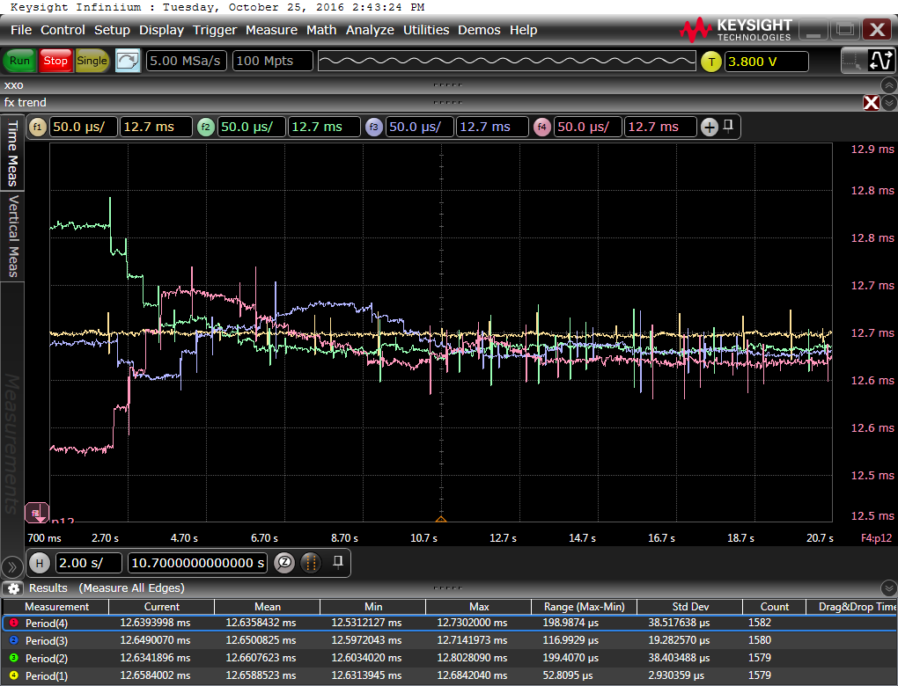

Measurements
============

Clock Skew Synchronization
--------------------------

### Short Term (Startup) Clock Skew Synchronization

| Result | Setup | Description | 
|--------|-------|-------------|
|      | soft1, cap1, osc2, net1, mcu1, func[1-4]-1, proAn[1-4]-1 | fifo 4, mean, caps, 20s | 
|      | soft1, cap1, osc1, net1, mcu1, func[1-4]-1, proAn[1-4]-1 | fifo 4, mean, caps, 5s | 
|      | soft1, cap0, osc2, net1, mcu1, func[1-4]-1, proAn[1-4]-1 | fifo 4, mean, 20s | 
|      | soft1, cap0, osc1, net1, mcu1, func[1-4]-1, proAn[1-4]-1 | fifo 4, mean, 5s | 
|  | soft1, cap1, osc2, net2, mcu1, func[1-4]-1, proAn[1-4]-1 | fifo 4, mean, caps, 20s |
|           | soft2, cap0, osc2, net1, mcu1, func[1-4]-1, proAn[1-4]-1 | progressive mean, caps, 20s | 
|          | soft2, cap0, osc1, net1, mcu1, func[1-4]-1, proAn[1-4]-1 | progressive mean, caps, 5s | 
|         | soft2, cap0, osc2, net1, mcu1, func[1-4]-1, proAn[1-4]-1 | progressive mean, 20s | 
|          | soft2, cap0, osc1, net1, mcu1, func[1-4]-1, proAn[1-4]-1 | progressive mean, 5s | 
|          | soft3, cap1, osc2, net1, mcu1, func[1-4]-1, proAn[1-4]-1 | raw observation, caps, 20s | 
|          | soft3, cap0, osc2, net1, mcu1, func[1-4]-1, proAn[1-4]-1 | raw observation, 20s | 
|         | soft3, soft4 (particle 4), cap0, osc3, net1, mcu1, func[1-4]-1, proAn[1-4]-1 | particle 4 having linear regression, raw observation otherwise, 46s |
|      | soft4 cap0, osc4, net1, mcu1, func[1-4]-1, proAn[1-4]-1 | linear regression, overshooting, 98s |
|        | soft5 cap0, osc2, net1, mcu1, func[1-4]-1, proAn[1-4]-1 | fifo 4, mean without outlier 2sigma, 20s |

| Video | Setup | Description | 
|-------|-------|-------------|
| [sync-method-mean-fifo40-pitch16](https://drive.google.com/open?id=0Bx3U4CEhKK8dNEVGNUY1clBXTzA)                                  | soft10, mean, fifo 40, pitch 16 | | 
| [sync-method-mean-fifo8-pitch16](https://drive.google.com/open?id=0Bx3U4CEhKK8dXzZoNkstTTV1Yjg)                                   | soft10, mean, fifo 8, pitch 16 | | 
| [sync-method-mean-without-outlier-2sigma-fifo15-pitch16](https://drive.google.com/open?id=0Bx3U4CEhKK8dNklJeGpqTVN4Qlk)           | soft10, mean without outlier, 2*σ , fifo 15, pitch 16 | outlier: values beyond µ+/-f*σ are not considered when averaging | 
| [sync-method-mean-without-outlier-2sigma-fifo40-pitch-20](https://drive.google.com/open?id=0Bx3U4CEhKK8ddTZubWFfcU8yYkU)          | soft10, mean without outlier, 2*σ, fifo 40, pitch 20 | outlier: values beyond µ+/-f*σ are not considered when averaging | 
| [sync-method-mean-without-outlier-2sigma-fifo40-pitch16](https://drive.google.com/open?id=0Bx3U4CEhKK8dQ0JteDRxSTdyMUE)           | soft10, mean without outlier, 2*σ, fifo 40, pitch 16 | outlier: values beyond µ+/-f*σ are not considered when averaging | 
| [sync-method-mean-without-marked-outlier-2sigma-fifo40-pitch0](https://drive.google.com/open?id=0Bx3U4CEhKK8dLUU3b09HZ0RUUXc)     | soft10, mean without marked outlier, 2 sigma, fifo 40, pitch 0 | marked outlier: marked when value enters the FiFo according to the current values in FiFo| 
| [sync-method-progressive-mean-pitch16](https://drive.google.com/open?id=0Bx3U4CEhKK8dcDgxMFJ1aENsRkE)                             | soft10, progressive mean 50%/50%, pitch 16 |  new = (old + new) / 2 | 
| [sync-method-raw-observation-no-smoothing-pitch12](https://drive.google.com/open?id=0Bx3U4CEhKK8dNTBrSmJPQ2UtSUE)                 | soft10, no smoothing, pitch 12 | observed value is new value without any averaging | 
| [sync-method-linear-regression-least-square-fifo40-pitch0](https://drive.google.com/open?id=0Bx3U4CEhKK8ddko4T3JDUGZIMlk)         | soft10, linear regression, fifo 40, pitch 0  | overshooting, outliers get too much weight | 
| [time-sync-sync-method-mean-fifo4-in-phase-shifting-pitch16](https://drive.google.com/open?id=0Bx3U4CEhKK8dZkdBdFRIeEwyWlk)       | soft10, mean, fifo 4, pitch 16, in phase shifting | local time ISR in phase shifting: 1st impl. approach | 


### Long Term Clock Skew Synchronization

| Result | Setup | Description | 
|--------|-------|-------------|
|       | soft1, cap1, osc5, net1, mcu1, func[1-4]-1, proAn[1-4]-1 | fifo 4, pitch 12, mean, caps, 2s |
|         | soft1, cap0, osc5, net1, mcu1, func[1-4]-1, proAn[1-4]-1 | fifo 4, pitch 12, mean, 2s |
|           | soft5, cap0, osc5, net1, mcu1, func[1-4]-1, proAn[1-4]-1 | fifo 4, pitch 12, mean, outlier 2sigma, 2s |
|      | soft6, cap1, osc5, net1, mcu1, func[1-4]-1, proAn[1-4]-1 | fifo 4, pitch 16, mean, caps, 2s |
|      | soft7, cap1, osc5, net1, mcu1, func[1-4]-1, proAn[1-4]-1 | fifo 4, pitch 20, mean, caps, 2s | 
|      | soft13, cap1, osc7, net1, mcu1, func[1-4]-1, proAn[1-4]-1 | fifo 4, pitch 20, mean, caps, 2s | 
|      | soft8, cap1, osc5, net1, mcu1, func[1-4]-1, proAn[1-4]-1 | fifo 4, pitch 24, mean, caps, 2s |
|      | soft9, cap1, osc5, net1, mcu1, func[1-4]-1, proAn[1-4]-1 | fifo 4, pitch 28, mean, caps, 2s | 


Jitter Measurements
-------------------

| Result | Setup | Description | 
|--------|-------|-------------|
|  | proAn1-2, soft11, cap1, osc6, net1, mcu1, hist1 | last time PDU falling edge jitter histogram, node (2,1), pitch 0 |
|  | proAn1-3, soft11, cap1, osc6, net1, mcu1, hist1 | last time PDU falling edge jitter histogram, node (3,1), pitch 0 |
|  | proAn1-4, soft11, cap1, osc6, net1, mcu1, hist1 | last time PDU falling edge jitter histogram, node (4,1), pitch 0 |
|  | proAn1-5, soft11, cap1, osc6, net1, mcu1, hist1 | last time PDU falling edge jitter histogram, node (5,1), pitch 0 |
|  | proAn1-6, soft11, cap1, osc6, net1, mcu1, hist1 | last time PDU falling edge jitter histogram, node (6,1), pitch 0 |
|  | proAn1-7, soft11, cap1, osc6, net1, mcu1, hist1 | last time PDU falling edge jitter histogram, node (7,1), pitch 0 |
|  | proAn1-8, soft11, cap1, osc6, net1, mcu1, hist1 | last time PDU falling edge jitter histogram, node (8,1), pitch 0 |
|  | proAn1-9, soft11, cap1, osc6, net1, mcu1, hist1 | last time PDU falling edge jitter histogram, node (9,1), pitch 0 |
|  | proAn1-10, soft11, cap1, osc6, net1, mcu1, hist1 | last time PDU falling edge jitter histogram, node (10,1), pitch 0 |
|  | proAn1-11, soft11, cap1, osc6, net1, mcu1, hist1 | last time PDU falling edge jitter histogram, node (11,1), pitch 0 |
|  | proAn1-12, soft11, cap1, osc6, net1, mcu1, hist1 | last time PDU falling edge jitter histogram, node (12,1), pitch 0 |
|  | proAn1-12, soft11, cap1, osc6, net1, mcu1, hist1 | last time PDU falling edge jitter histogram, node (13,1), , pitch 0, long term |
| | |
 | proAn1-2, soft12, cap1, osc6, net1, mcu1, hist1 | last time PDU falling edge jitter histogram, node (1,1), pitch 18 |
 | proAn1-3, soft12, cap1, osc6, net1, mcu1, hist1 | last time PDU falling edge jitter histogram, node (2,1), pitch 18 |
 | proAn1-4, soft12, cap1, osc6, net1, mcu1, hist1 | last time PDU falling edge jitter histogram, node (3,1), pitch 18 |
 | proAn1-5, soft12, cap1, osc6, net1, mcu1, hist1 | last time PDU falling edge jitter histogram, node (4,1), pitch 18 |
 | proAn1-6, soft12, cap1, osc6, net1, mcu1, hist1 | last time PDU falling edge jitter histogram, node (5,1), pitch 18 |
 | proAn1-7, soft12, cap1, osc6, net1, mcu1, hist1 | last time PDU falling edge jitter histogram, node (6,1), pitch 18 |
 | proAn1-8, soft12, cap1, osc6, net1, mcu1, hist1 | last time PDU falling edge jitter histogram, node (7,1), pitch 18 |
 | proAn1-9, soft12, cap1, osc6, net1, mcu1, hist1 | last time PDU falling edge jitter histogram, node (8,1), pitch 18 |
 | proAn1-10, soft12, cap1, osc6, net1, mcu1, hist1 | last time PDU falling edge jitter histogram, node (9,1), pitch 18 |
 | proAn1-11, soft12, cap1, osc6, net1, mcu1, hist1 | last time PDU falling edge jitter histogram, node (10,1), pitch 18 |
 | proAn1-12, soft12, cap1, osc6, net1, mcu1, hist1 | last time PDU falling edge jitter histogram, node (11,1), pitch 18 |

* Expected discretization step of particle (12,1): +/- 63.5 * (1/8284000) = +/- 7.665µs
* A pitch of 20-22 seems reasonable:
  * according package length distribution - 20
  * according trend 22
  * 16 too low, 28 too high

Setup Configurations
====================

Particle Speed (internal RC osc.)
---------------------------------

| Particle ID | Approx. Frequency [MHz]|
|-------------|--------------------|
| 1  | 8.178 |
| 2  | 8.180 |
| 3  | 8.191 |
| 4  | 8.211 |
| 5  | 8.241 |
| 6  | 8.254 |
| 7  | 8.279 |
| 8  | 8.284 |
| 9  | 8.386 |
| 10 | 8.303 |
| 11 | 8.355 |
| 12 | 8.382 |

* Measurements taken with particles having room temperature.
* Measured after powered 30sec. 
* Averaged 5sec (~7000 samples).
* Measurements could be reproduced in a 2nd run.
* Frequency is voltage dependent; values are understood to be "relative".
* Vcc approx. 5v, see power supply of setup mcu1.

Order Setup in Measurements
---------------------------

Setup ID | Network Dimension | Order P.ID | Address | Details |
|--------|-------------------|-------|--------------|---------|
| net1   | (12x1) | {6, 3,  9, 1, 7, 4, 11, 2, 10, 5, 12, 8} | {(1,1), (2,1), (3,1), (4,1), (5,1), (6,1), (7,1), (8,1), (9,1), (10,1), (11,1), (12,1)} | order having good discrepancy in between subsequent particles' frequency |
| net2   | (12x1) | {6, 2, 10, 1, 8, 4, 12, 3,  9, 7, 11, 5} | {(1,1), (2,1), (3,1), (4,1), (5,1), (6,1), (7,1), (8,1), (9,1), (10,1), (11,1), (12,1)} | same as 1 but less discrepancy |


Oscilloscope Measurement Notes
------------------------------

| Setup ID | Capture Duration | [Sa/s] | Trigger     | Pre-Trigger [s] | Time/Div. |
|----------|----------------------|---------|-------------|-----------------|-----------|
| osc1     | 2.5s  -  7.5s           | 5M      | An. 1, 3.8v, rising local time ISR | 5                | 500ms     |
| osc2     | 0.7s  - 20.7s           | 5M      | An. 1, 3.8v, rising local time ISR | 10.7             | 2s        |
| osc3     | 1s    - 46s             | 2M      | An. 1, 3.8v, rising local time ISR | 21               | 5s        |
| osc4     |       - 98s             | 1M      | An. 1, 3.8v, rising local time ISR | 48               | 10s       |
| osc5     | 0s    -  2s             | 5M      | An. 1, 3.8v, rising local time ISR | 0                | 100ms     |
| osc6     | 7.8ms -  7.9ms          | 10G     | An. 1, 2.5v, 1st falling edge of transmission         | ~7.87ms   | 10µs      |
| osc7     | -1s    -  1s             | 5M      | An. 1, 3.8v, rising local time ISR | 0                | 200ms     |
   
* Oscilloscope: Keysight MSO-S 354A Mixed Signal Oscilloscope 2.5GHz 20GSa/s 10-bit ADC infiniium S-Series

| Function Config ID | Function Name | Action | Input Data | Color |
|--------------------|---------------|--------|------------|-------|
| func1-1            | f1            | trend  | Analogue 1 | beige |
| func2-1            | f2            | trend  | Analogue 2 | green |
| func3-1            | f3            | trend  | Analogue 3 | blue  |
| func4-1            | f4            | trend  | Analogue 4 | purple | 
| hist1              | -             | histogram max 1280 bins | Analogue 1 | cyan | 

| Connection ID | Probe | Input Data | Coupling |
|---------------|-------|------------|----------|
| proAn1-1 | Analogue 1 | internal time tracking ISR: Particle  1 | 1MΩ, DC |
| proAn2-1 | Analogue 2 | internal time tracking ISR: Particle  4 | 1MΩ, DC |
| proAn3-1 | Analogue 3 | internal time tracking ISR: Particle  7 | 1MΩ, DC |
| proAn4-1 | Analogue 4 | internal time tracking ISR: Particle 12 | 1MΩ, DC |
| proAn1-2 | Analogue 1 | rx north, particle 2, address (2,1)     | 1MΩ, DC |
| proAn1-3 | Analogue 1 | rx north, particle 3, address (3,1)     | 1MΩ, DC |
| proAn1-4 | Analogue 1 | rx north, particle 4, address (4,1)     | 1MΩ, DC |
| proAn1-5 | Analogue 1 | rx north, particle 5, address (5,1)     | 1MΩ, DC |
| proAn1-6 | Analogue 1 | rx north, particle 6, address (6,1)     | 1MΩ, DC |
| proAn1-7 | Analogue 1 | rx north, particle 7, address (7,1)     | 1MΩ, DC |
| proAn1-8 | Analogue 1 | rx north, particle 8, address (8,1)     | 1MΩ, DC |
| proAn1-9 | Analogue 1 | rx north, particle 9, address (9,1)     | 1MΩ, DC |
| proAn1-10 | Analogue 1 | rx north, particle 10, address (10,1)  | 1MΩ, DC |
| proAn1-11 | Analogue 1 | rx north, particle 11, address (11,1)  | 1MΩ, DC |
| proAn1-12 | Analogue 1 | rx north, particle 12, address (12,1)  | 1MΩ, DC |


Capacitor Configurations
------------------------

| Setup ID | Caps [µF] | Configuration |
|----------|-----------|---------------|
| cap0     | -         | no additional caps |
| cap1     | 560       | each 2nd particle  |

Software Configuration
----------------------

| Setup ID | Averaging Method | outlier rejection | FiFo Size [Elements] | Pitch | Other Configuration |
|----------|------------------|-------------------|----------------------|-------|-------|
| soft1    | mean             | -                 | 4                    | 12   | baud1, time1 |
| soft2    | progressive mean (75% of old value + 25 % new value) | - | -| 12   | baud1, time1 |
| soft3    | raw observation  | -                 | -                    | 12   | baud1, time1 | 
| soft4    | least square fitting  | -            | 40                   | 12   | baud1, time1 | 
| soft5    | mean without outlier  | 2*σ          | 4                    | 12   | baud1, time1 | 
| soft6    | mean             | -                 | 4                    | 16   | baud1, time1 | 
| soft7    | mean             | -                 | 4                    | 20   | baud1, time1 | 
| soft8    | mean             | -                 | 4                    | 24   | baud1, time1 | 
| soft9    | mean             | -                 | 4                    | 28   | baud1, time1 | 
| soft10   | -                | -                 | -                    | -    | baud1, time1 | 
| soft11   | mean             | -                 | 4                    | 0    | baud1, time1 | 
| soft12   | mean             | -                 | 4                    | 18   | baud1, time1 | 
| soft13   | mean             | -                 | 4                    | 22   | baud1, time1 | 

| Setup ID | Manchester Clock Delay [MCU Cycles] | Overtime Limit Short Interval | Overtime Limit Long Interval |
|----------|-----------|-------------------------------|--------------------------------------------------------|
| baud1    | 1024      | 0.75 * 1024                   | 1.25 * 1024 | 

| Setup ID | Local Time Tracking Delay [MCU Cycles] |
|----------|-------------------------------------------------|
| time1    | 51 * baud1.ManchesterClockDelay (see baud1) |

* Pitch: Manually added offset to the observed baud rate delay.


Mircocontroller Configuration
-----------------------------

| Configuration ID | Details | Fuses | Power Supply |
|------------------|---------|-------|--------------|
| mcu1             | internal RC 8MHz, clk out | ```FUSES = { .low =  (FUSE_SUT_CKSEL0 & FUSE_SUT_CKSEL2 & FUSE_SUT_CKSEL3 & FUSE_SUT_CKSEL4 & FUSE_CKOUT), .high = HFUSE_DEFAULT, .extended = EFUSE_DEFAULT,};``` | Anker, USB, max. 5V/3A |
